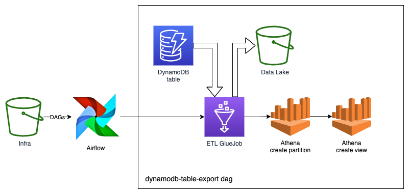

# aws-managed-airflow-deployment

This is an example of MWAA deployment using CloudFormation and GitHub actions.

## Architecture

### Stacks

Infra stack - includes common infrastructure resources that do not need to be deployed
often, such as infrastructure and data lake buckets, VPC and internet gateway.

Airflow stack - includes all the resources needed for managed Airflow environment
deployment, such as subnet configuration, execution role and policy, and
environment itself.

DynamoDbToS3EtlJob stack is an example of DynamoDB to S3 ETL GlueJob.

## Deployment

GitHub actions automatically deploys all the CloudFormation stacks for you including
Airflow dags and `requirements.txt` file.
